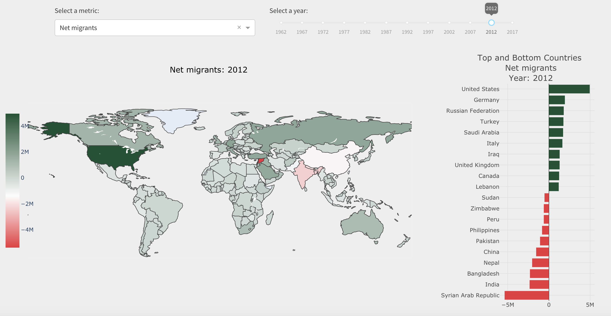
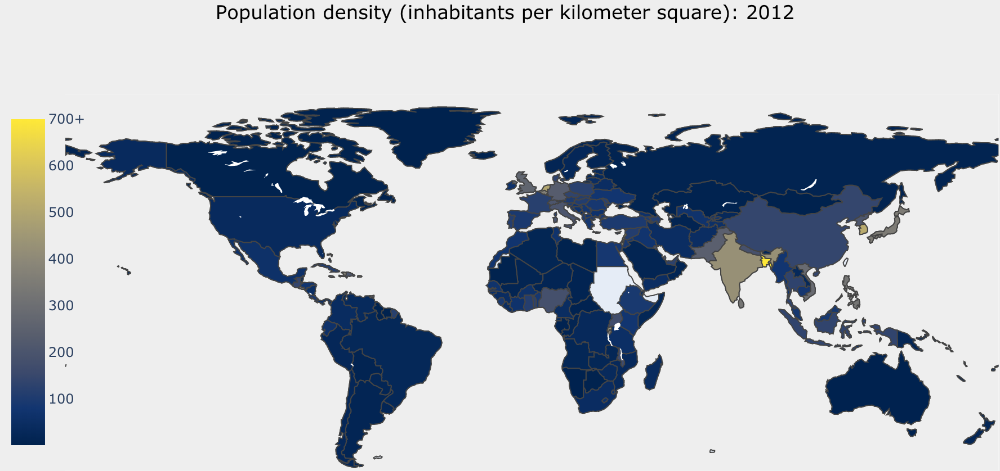
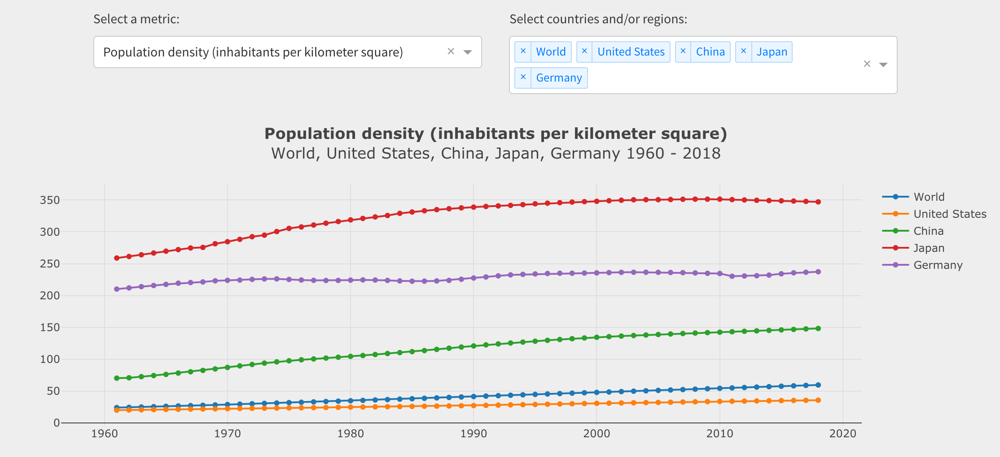

# Migration and Population Density Dashboard

If you are interested in [how migration has changed by country, region, and year, this dashboard](https://www.dashboardom.com/migration-population) allows you to do this analysis. 

Metrics: 
- Net migrants
- Net migrants (as a percentage of population)
- Population density

* Data source: WorldBank
* Dataset: [Kaggle Datasets](https://www.kaggle.com/eliasdabbas/migration-data-worldbank-1960-2018)
* Live Dashboard: https://www.dashboardom.com/migration-population

Made with Plotly's Dash